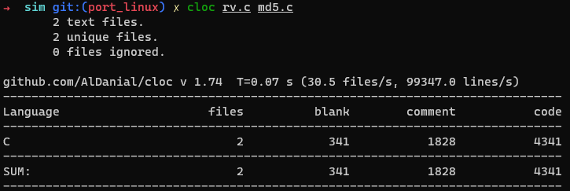
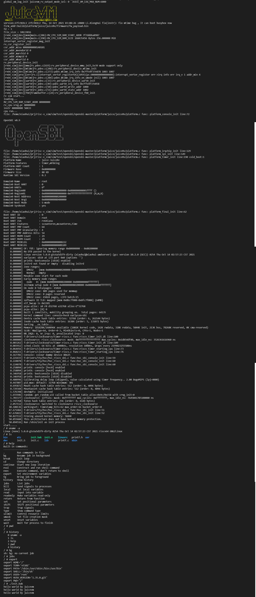
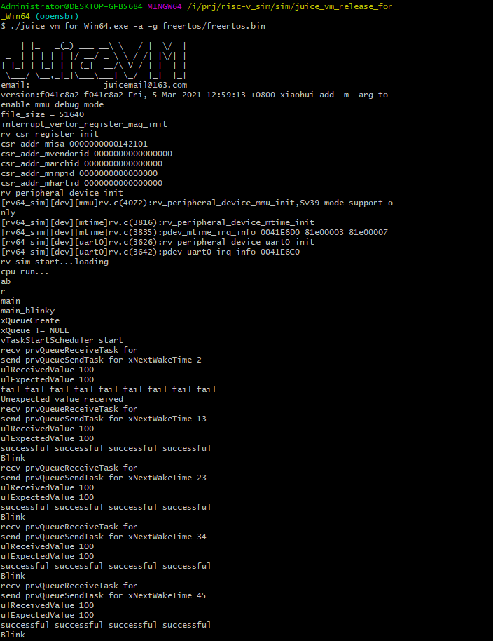
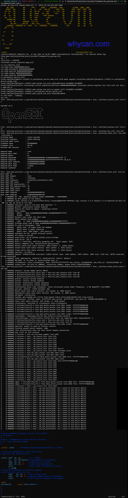

                                                 

* [简介](#简介)
* [Juice Vm的优点](#juice-vm的优点)
* [Juice Vm的组成](#juice-vm的组成)
* [Juice Vm 代码统计](#Juice-Vm-代码统计)
* [Juice Vm的地址空间分布](#juice-vm的地址空间分布)
* [Juice Vm下的软件移植进度](#juice-vm下的软件移植进度)
* [快速安装](#快速安装)
* [<strong>快速上手</strong>](#快速上手)
* [运行freertos 截图](#运行freertos-截图)
* [运行rt-thread 截图](#运行rt-thread-截图)
* [运行linx 5.0.0 截图](#运行linx-500-截图)
* [<strong>软件参数使用说明</strong>](#软件参数使用说明)
* [社区支持](#社区支持)
    * [<strong>CHANGE LOG</strong>](#change-log)
        * [<strong>2021-05-25</strong>](#2021-05-25)
        * [<strong>20210524进展公布，发布包发布juice_vm_release_for_Linux_c21682d3.zip：</strong>](#20210524进展公布，发布包发布juice_vm_release_for_Linux_c21682d3.zip：)
        * [<strong>20210508更新：</strong>](#20210508更新)
        * [<strong>20210427更新：</strong>](#20210427更新)
        * [<strong>20210424更新:</strong>](#20210424更新)
        * [<strong>软件适配进度</strong>](#软件适配进度)
        * [<strong>更新了支持的参数：</strong>](#更新了支持的参数)
        * [<strong>202210306更新:</strong>](#202210306更新)
        * [<strong>软件适配进度</strong>](#软件适配进度-1)
        * [<strong>更新了支持的参数：</strong>](#更新了支持的参数-1)
        * [<strong>提交日志</strong>](#提交日志)
        * [以下 2021-03-06 更新:](#以下-2021-03-06-更新)
        * [<strong>更新了支持的参数：</strong>](#更新了支持的参数-2)
        * [<strong>软件适配进度</strong>](#软件适配进度-2)
* [鸣谢](#鸣谢)
* [联系作者](#联系作者)

## 简介
juice vm诞生于2020年，以实现可运行最新kernel主线的RISC-V最小虚拟机为目标而诞生的，设计之初秉承着可以在 **RAM** 只有 **百KB** 级别的平台上运行，不引入除了**c99**标准外的第三方依赖。

juice vm按照gcc所支持的C99标准编写，无第三方库依赖，浅显易懂，且具有方便移植的特性（可快速移植到多种主流 MCU 及支持c环境的所有平台上）。

juice vm去掉注释后展开所有的宏的代码行数仅**12523**行，仅**36104**字，足够的小巧。

## Juice Vm的优点

- 资源占用极低。

- 跨平台、可快速移植。

## Juice Vm的组成
 - 指令集：RV64IMASU.
 - 支持了M-mode,U-mode,S-mode下的mtime.
 - 超级精简的uart，只有读和写两个外设寄存器.
 - 超级精简的MMU SV39支持.
 - 支持RISC-V官方标准的异常和中断托管

## Juice Vm 代码统计
 

## Juice Vm的地址空间分布

| 虚拟机版本号 | 起始地址 | 大小(字节) | 寄存器名称 | 说明  | 所用宏名称 |
| :-----------: | :-------- | :------- | :------- | :------------| :------------ |
| 430de41bc | 0x80000000 | 0x12C00000 | SRAM | 内部存储 | RV_CPU_SIM_RAM_START_ADDR RV_CPU_SIM_RAM_SIZE |
| 430de41bc | pdev_uart0_write_addr | 0x1 | UART_WRITE | uart发送寄存器 | pdev_uart0_write_addr |
| 430de41bc | pdev_uart0_read_addr | 0x1 | UART_READ | uart接收寄存器 | pdev_uart0_read_addr |
| 430de41bc | pdev_uart0_state_addr | 0x1 | UART_STATE | uart状态寄存器 | pdev_uart0_state_addr pdev_uart0_free_state pdev_uart0_readbusy_state |
| 430de41bc | rv_sim_pdev_clint_mtime_addr | 0x8 | mtime | mtime当前计数寄存器 | rv_sim_pdev_clint_mtime_addr |
| 430de41bc | rv_sim_pdev_clint_mtimecmp_addr | 0x8 | mtimecmp | mtime当前比较寄存器 | rv_sim_pdev_clint_mtimecmp_addr |
| 430de41bc(linux only) | pdev_netcard0_write_addr | 0x1 | netcard0_write | 网卡发送缓冲区起始地址 | pdev_netcard0_write_addr |
| 430de41bc(linux only) | pdev_netcard0_write_end_addr | 0x1 | netcard0_write_end | 网卡缓冲区末尾地址 | pdev_netcard0_write_end_addr |
| 430de41bc(linux only) | pdev_netcard0_write_cnt_H_addr | 0x1 | netcard0_write_cnt_H | 网卡发送缓冲区数据大小高8位 | pdev_netcard0_write_cnt_H_addr |
| 430de41bc(linux only) | pdev_netcard0_write_cnt_L_addr | 0x1 | netcard0_write_cnt_L | 网卡发送缓冲区数据大小低8位 | pdev_netcard0_write_cnt_L_addr |
| 430de41bc(linux only) | pdev_netcard0_write_start_addr | 0x1 | netcard0_write_start | 网卡使能发送 | pdev_netcard0_write_start_addr |
| 430de41bc(linux only) | pdev_netcard0_read_addr | 0x1 | netcard0_read | 网卡接收缓冲区起始地址 | pdev_netcard0_read_addr |
| 430de41bc(linux only) | pdev_netcard0_read_end_addr | 0x1 | netcard0_read_end | 网卡接收缓冲区末尾地址 | pdev_netcard0_read_end_addr |
| 430de41bc(linux only) | pdev_netcard0_readbuf_cnt_H_addr | 0x1 | netcard0_readbuf_cnt_H | 网卡接收缓冲区数据大小高8位 | pdev_netcard0_readbuf_cnt_H_addr |
| 430de41bc(linux only) | pdev_netcard0_readbuf_cnt_L_addr | 0x1 | netcard0_readbuf_cnt_L | 网卡接收缓冲区数据大小低8位 | pdev_netcard0_readbuf_cnt_L_addr |
| 430de41bc(linux only) | pdev_netcard0_state_addr | 0x1 | netcard0_state | 网卡当前状态 | pdev_netcard0_state_addr pdev_netcard0_free_state pdev_netcard0_readbusy_state |
| 430de41bc | pdev_fb0_write_x_H_addr | 0x1 | fb0_write_x_H | fb0写坐标x高8位 | pdev_fb0_write_x_H_addr |
| 430de41bc | pdev_fb0_write_x_L_addr | 0x1 | fb0_write_x_L | fb0写坐标x低8位 | pdev_fb0_write_x_L_addr |
| 430de41bc | pdev_fb0_write_y_H_addr | 0x1 | fb0_write_y_H | fb0写坐标y高8位 | pdev_fb0_write_y_H_addr |
| 430de41bc | pdev_fb0_write_y_L_addr | 0x1 | fb0_write_y_L | fb0写坐标y低8位 | pdev_fb0_write_y_L_addr |
| 430de41bc | pdev_fb0_write_r_addr | 0x1 | fb0_write_r_ | fb0写坐标红色分量 | pdev_fb0_write_r_addr |
| 430de41bc | pdev_fb0_write_g_addr | 0x1 | fb0_write_g | fb0写坐标绿色分量 | pdev_fb0_write_g_addr |
| 430de41bc | pdev_fb0_write_b_addr | 0x1 | fb0_write_g | fb0写坐标蓝色分量 | pdev_fb0_write_b_addr |
| 430de41bc | pdev_fb0_write_set_addr | 0x1 | fb0_write_set | fb0设置颜色 | pdev_fb0_write_set_addr |
| 430de41bc | pdev_fb0_write_render_addr | 0x1 | fb0_write_render | fb0使能渲染 | pdev_fb0_write_render_addr |


## Juice Vm下的软件移植进度
- 已经支持了c语言编程。
- 已完成freertos移植。
- 已完成mbedtls移植。
- 已完成mmu sv39测试。
- 已完成mtime测试。
- 已完成opensbi移植 [传送门](https://github.com/juiceRv/opensbi_juicevm_port)。
- 已完成rt-thread移植，感谢@熊大和@Andy Chen的支持 [传送门](https://github.com/RT-Thread/rt-thread/tree/master/bsp/juicevm)。
- 已完成kernel主线5.0.0 [传送门](https://github.com/juiceRv/kernel_juicevm_port)。
- 上传Juice Vm下的GCC toolchain [传送门](https://github.com/juiceRv/gcc-gnu-toolchains-for-juicevm)。
- 适配 GDB 通用接口支持。
- 适配 RT-SMART **TODO**。


## 快速安装
~~- **UBUNTU/DEBIAN** APT安装~~
```
    echo "deb http://xiaohui.mongoyun.com:3333/ trusty main" | sudo tee -a /etc/apt/sources.list
    wget -O - http://xiaohui.mongoyun.com:3333/key/deb.gpg.key | sudo apt-key add -
    sudo apt update
    sudo apt install juicevm
    juicevm
```

- **CENTOS**
```
    wget -O juice_vm_release_for_Linux_laster.zip https://github.com/juiceRv/JuiceVm/raw/master/juice_vm_release_for_Linux_laster.zip
    unzip juice_vm_release_for_Linux_laster.zip
    cd linux
    sudo chmod +x juicevm_rv64_for_linux.out
    ./juicevm_rv64_for_linux.out
```
- **WINDOW**

**编译中**
## **快速上手**
- [快速上手运行Hello world](./doc/get-started.md) **编写中**。
- [运行Free rtos](./doc/run-freertos.md) **编写中**。
- [运行mbedtls](./doc/run-mbedtls.md) **编写中**。
- [运行SV39 MMU测试](./doc/run-mmu_sv39.md) **编写中**。
- [运行mtime测试](./doc/run-mmu_sv39.md) **编写中**。
- [运行mtime测试](./doc/run-mtime.md) **编写中**。
- [运行 RT-thread](./doc/run-rtt.md) **编写中**。
- [运行 linux kernel](./doc/run-linux.md) **编写中**。

## 运行linx 5.0.0 busybox 截图


## 运行freertos 截图


## 运行rt-thread 截图


## 运行linx 5.0.0 截图


## **软件参数使用说明**
| 参数 | 参数名称 | 说明 |
| :------ | :------- | :-------|
| t | enable test mode | 进入固件测试模式<br>当出现下面的状态会结束运行并且打印出通过还是失败的字样,x3_gp寄存器的值为1 和 x17_a7寄存器的值为93时,进入了ecall异常就会触发。x10_a0 寄存器的值为 0时打印pass字样，否则打印fail字样 |
| **T** | enable trap debug mode | 使能异常调试模式，出现异常时会打印当前异常的调试信息 |
| d | enable debug mode | 打开虚拟机内所有的调试选项，输出最详细的调试信息，包括指令译码，处理执行，当前寄存器列表，csr列表等 |
| c | print cst operation msg | 打开虚拟机的csr寄存器读写调试信息。读写csr寄存器的时候都会打印对应的csr寄存器的值 |
| a | diable all debug msg | 关闭所有调试选项，译码调试默认打开 |
| x | enable test mode for exception | 打开异常测试模式，当出现异常时结束运行 |
| g | enable better readability printing | 使用可读性更好的方式打印信息 |
| e | disable all error msg | 关闭所有的错误信息打印 |
| i | enable all instr debug msg | 打开所有指令调试信息打印 |
| m | enable mmu debug msg | 打开mmu的遍历调试信息 |
| p | print mmu page 8 byte data |  hexdump打印mmu页表里的8字节数据 |
| **P** | print mmu page 4K Byte data | hexdump打印mmu页表里的4K字节数据 |
| s | uart addr not use mmu translation | 启用mmu翻译时，忽略uart的外设地址，在启用了mmu的时候也可以直接通过uart原始物理地址来操作uart外设 |
| **S** | switch mode debug info | 打开切换mode时的调试信息，m-mode,s-mode和u-mode切换的时候都会打印调试信息 |
| **M** | disable mmu err msg | 关闭mmu缺页异常，访问异常，加载异常的错误信息 |
| r | enable trap debug msg | 打印更详细的进入中断的调试信息 |
| **A** | enable addr translation debug print | 打印地址转换的调试打印 |
| **L**(n) | log mode | output_mode_sel n = 0 -> stdout<br> 1 -> log_buf UNIX SYS ONLY(buf_size:(2900))<br> 2 -> none<br> 选择虚拟机输出的方式，1，直接标准输出。2，使用一个buf先缓存，退出的时候再输出bug大小2900Byte。3，不输出。<br> |
| l | enable endless loop check (RV_ENDLESS_LOOP_CHECK_EXIT_CNT:(3)) | 启用死循环监测机制，当有连续3次出现同样的指令执行流程(包括寄存器和csr寄存器的值都没有改变),结束虚拟机的运行。可以搭配-L参数使用，方便调试固件。一般assert都是直接死循环。|


# 社区支持
   挖坑网首发 感谢晕哥一路的支持：[https://whycan.com/t_5844.html](https://whycan.com/t_5844.html)

## **CHANGE LOG**
### **2021-10-24更新：**
- 1.修复指令bug并通过risc-v官方指令集测试。
- 2.成功启动busybox。固件:linux5_busybox_fw_payload.bin
- 3.在linux平台下支持模拟网卡。
- 4.支持模拟显示器。

### **2021-05-25**
- opensbi和kernel的代码已发布到github！！！
[https://github.com/juiceRv/kernel_juicevm_port](https://github.com/juiceRv/kernel_juicevm_port)
kernel的配置文件在arch/riscv/configs/juicevm_defconfig,make ARCH=riscv juicevm_defconfig  
- 需要修改下arch/riscv/configs/juicevm_defconfig里的CONFIG_INITRAMFS_SOURCE="/mnt/ssd_prj/risc-v_sim/sim/test/opensbi/opensbi-master/rootfs"  
修改为opensbi里的路径  

    opensbi仓库  
    [https://github.com/juiceRv/opensbi_juicevm_port](https://github.com/juiceRv/opensbi_juicevm_port)

    toolchains  
    [https://github.com/juiceRv/gcc-gnu-toolchains-for-juicevm](https://github.com/juiceRv/gcc-gnu-toolchains-for-juicevm)

***

### **20210524进展公布，发布包发布juice_vm_release_for_Linux_c21682d3.zip：**
1. 修复了mtime在m-mode,s-mode和u-mode下的中断处理漏洞。
2. 修复了ecall在s-mode下的漏洞。
3. 修复了在s-mode和u-mode下进入异常模式，更新csr寄存器的漏洞。
4. 移植了linux。  

    **juice_vm成功运行kernel主线5.0.0。**  
    **juice_vm成功运行kernel主线5.0.0。**  
    **juice_vm成功运行kernel主线5.0.0。**  

***

### **20210508更新：**
1. 上传一个ubuntu20.04上可以正常运行的发布包,感谢@XBOOT大佬的反馈。
2. 添加了div指令支持。
3. 修复了divuw，divw，remu，remw，amomin.w，amoswap.w的指令错误。

***
### **20210427更新：**
    提交了RT-Thread 的适配 到官方仓库：详情请点击https://github.com/RT-Thread/rt-thread/tree/master/bsp/juicevm
***

### **20210424更新:**
#### **软件适配进度**
1.已完成rt-thread移植。

#### **更新了支持的参数：**
1. 新增-L参数用于指定打印日志方式。
2. 新增-l参数用于在出现死循环的时候结束运行。
3. 新增-r参数用于开启trap调试打印
4. 更新了Alive logo。
5. 新增-T参数用于执行过程输出反汇编调试打印。
6. 新增m模块支持。
7. 新增s-mode支持(u-mode支持中）。

***


### **202210306更新:**  
#### **软件适配进度**
1. 已经支持了c语言编程。
2. 已完成freertos移植。
3. 已完成mebedtls移植。
4. 已完成mmu sv39测试。
5. 已完成mtimer测试。
6. 已完成opensbi移植。

#### **更新了支持的参数：**
- -m **参数用于开启mmu调试信息**
#### **提交日志**

- 1113e998 add sfence.vma instr
- f118d476 add print instr support
- 1e3e7204 add AMOSWAP.D LR.D and SC.D instr support
- 686741ea add AMOSWAP.D LR.D and SC.D instr support
- f2f699c0 add -i arg to enable instr print support
- 113f66da add misa csr support
- 19cf60d1 fix divu err
- ad512e54 add divu remw and remu instr
- 9abc0566 fix mem overflow
- 0ceb663e fix divw instr and add REMW instr
- 10a2ea78 fix divw instr
- 9c93c4ce add amoswap.w , mul and divw instr
- df10ad45 change the fireware start addr to 0x80000000
- d31b4ac1 add amoadd.w inst

***

### 以下 2021-03-06 更新:

无第三方库不到5000行C语言实现一个risc-v虚拟机，带mmu

基于指令集 rv64i

实现了mtime，超级精简的uart和mmu sv39.

#### **更新了支持的参数：**
- -a **关闭所有调试打印**
- -e **关闭错误打印**
- -g **用更好的方式来显示打印**
- -d **开启所有调试打印(包括寄存器和csr列表)**
- -i **开启指令解码调试信息**
- -m **开启mmu调试信息**

#### **软件适配进度**
1. 已经支持了c语言编程。
2. 已完成freertos移植。
3. 已完成mebedtls移植。
4. 已完成mmu sv39测试。
5. 已完成mtimer测试。
6. 已完成opensbi移植。

# 鸣谢
- [哇酷网](https://whycan.com/t_5844.html)
- [RT-thread](https://www.rt-thread.io/)
- [RISC-V](https://riscv.org/)
- [linux](https://www.kernel.org/)
- [gh-md-toc](https://github.com/ekalinin/github-markdown-toc)
    
# 联系作者
juicemail@163.com
